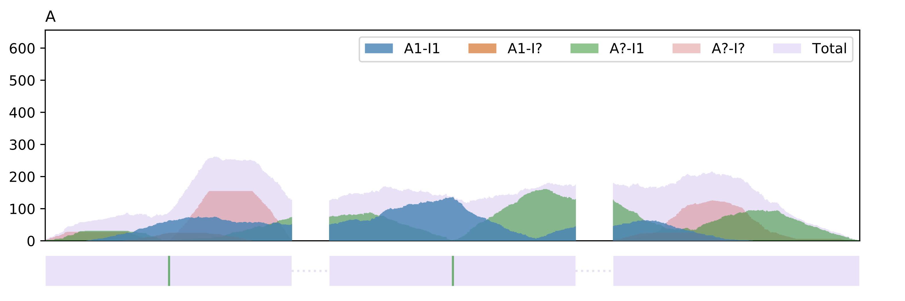
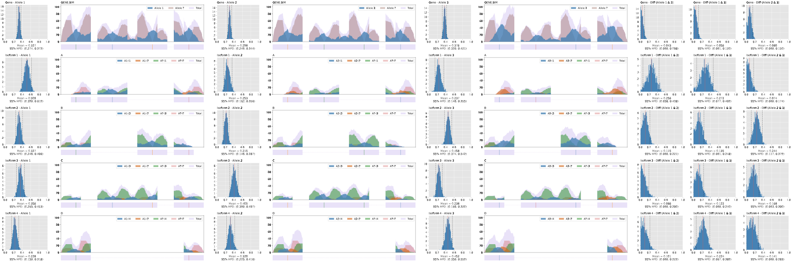

# BYASE software documentation

BYASE is a Python package for simultaneous identification of gene-level and isoform-level ASE of polyploid (diploid or higher) organisms from single-end or paired-end RNA-seq data, as long as there are predefined annotations and phased or non-phased SNP information. BYASE also contains a graphical user interface (GUI) tool BYASE-GUI to guide users through the workflow and to help better display and analyze results.

BYASE uses Bayesian inference for probabilistic analysis. Bayesian inference treats unknown parameters as random variables, it produces a posterior distribution for each parameter as a prediction rather than generating a single estimate, which clearly describes the uncertainty of the estimate. This is especially useful for isoform-level based analysis, because even for high coverage RNA-seq data, it is not always sufficient to accurately predict transcript expression.

Because genes can contain dozens of isoforms, it should be ensured that the MCMC method works well on high-dimensional parameters. Some widely used samplers, such as Metropolis-Hastings, did not converge well in our tests with genes of many isoforms and are therefore not suitable for inference. BYASE uses MCMC method to obtain samples to describe posterior distributions of inferred parameters. BYASE uses the No-U-Turn Sampler as the MCMC sampler, which converges to high dimensional distributions much more quickly, which ensures that we can get more accurate results in less time with fewer samples.


# Installation of BYASE


BYASE is released as a Python package which requires **Python 3.6**
or higher to be installed on the computer.

To install BYASE, some Python packages that BYASE depends on
should be installed first. In order to to successfully compile
some of the packages, several system libraries should be
pre-installed. For example, on **Ubuntu 18.04**, these libraries
may need to be installed:

```shell
sudo apt install zlib1g-dev libbz2-dev liblzma-dev
```

Then, use `pip` to install dependent packages:
```shell
pip3 install --user numpy scipy pandas cython
pip3 install --user pymc3 pyarrow
pip3 install --user pysam htseq
```

Then, use `pip` to install BYASE:
```shell
pip3 install --user byase
```

*After the installation, if you cannot run `byase` from the terminal,
this is caused by the executable binary file `byase` not being found
in the system path, you may need to run:*
```shell
export PATH=~/.local/bin:$PATH
```

To use the **plotting module**, `matplotlib` should also be
installed:
```shell
pip3 install --user matplotlib
```
If BYASE is run on a server or cluster system, the plotting module
may not be used, then the installation of package `matplotlib` can be
ignored, because some problem may be encountered during the
installation of `matplotlib` on such systems.

# Installation of BYASE-GUI


To use BYASE-GUI, BYASE should be installed first, the installation
of BYASE is documented [here](https://github.com/ncjllld/byase).

BYASE-GUI is built using the [wxPython](https://wxpython.org/)
framework, in order to successfully compile the package
`wxPython`, some system libraries should be pre-installed.
For example, on **Ubuntu 18.04**, these libraries may need
to be installed:
```shell
sudo apt install libgtk-3-0 libgstreamer1.0-dev libgstreamer-plugins-base1.0-dev freeglut3-dev libwebkitgtk-3.0-dev libjpeg-dev libtiff-dev
```
Then, use `pip` to install dependent packages:
```shell
pip3 install --user psutil
pip3 install --user wxPython
```

Then, use `pip` to install BYASE-GUI:
```shell
pip3 install --user byase-gui
```

*After the installation, if you cannot run `byase-gui` from the terminal,
this is caused by the executable binary file `byase-gui` not being found
in the system path, you may need to run:*
```shell
export PATH=~/.local/bin:$PATH
```


# Usage of BYASE

BYASE contains several modules to complete the entire workflow, the basic usage is as follows:
```shell
byase [subcommand] [args...]
```
BYASE supports the following subcommands:

* `gen-task` - Generate tasks.
* `extract-region` - Extract long continuous regions.
* `stat-insert-size` - Stat insert size of paired-end BAM files.
* `inference` - Perform Bayesian inference on tasks.
* `resume` - Resume Bayesian inference.
* `stats` - Stats results.
* `trace` - Extract MCMC traces.
* `plot` - Plot.


!!! Note
    The existence of alignment bias greatly affects the ASE results. Since BYASE aims to focus on downstream analysis, it assumes that the alignments are unbiased. For diploid organisms, we recommend that users use phased SNVs to construct a diploid genome using [vcf2diplod](https://github.com/abyzovlab/vcf2diploid), and then align each read with the two haplotypes separately, and choose the best alignment between the two. In this way, the alignment bias should be reduced as much as possible.

## Generating tasks

In the ASE estimation, heterozygous SNPs are used to separate reads from different alleles. If there are multiple SNPs on the exons of the target gene, haplotyping is required to take advantage of the information they provide together. However, There is no guarantee that all of SNPs can be phased, which means they cannot be used in a single task. BYASE divides the SNPs into two groups, a phased group and a non-phased group. SNPs in the phased group are used in a single task to maximize the inference capabilities they provide together. A separate inference task is run for each SNP in the non-phased group as a supplement.

BYASE accepts a `GFF` format file as the input gene annotation, and a `VCF` format file as the input variation annotation. BYASE provides a subcommand `gen-task` to generate all the necessary information about inference tasks and store it into databases. A self-structured database such as `sqlite3` should be enough, however, the lock mechanism of `sqlite3` may be incompatible with the file system of some cluster system. BYASE implements a simple database-like structure that stores information in binary format and indexes it for quick access.

The usage of subcommand `gen-task` is as follows:

* `-g, --gff` - The path of the `GFF` annotation file.
* `-G, --gene-feature` - The feature type name of genes, in the 3rd column of the `GFF` file. This option is used to guide BYASE find genes. (DEFAULT: gene)
* `-I, --isoform-feature` - The feature type name of isoforms, in the 3rd column of the `GFF` file. This option is used to guide BYASE to find isoforms. (DEFAULT: transcript)
* `-A, --gene-name-attr` - The attribute that describes gene names, extracted from the 9th column of the `GFF` file. This option is used to specify gene names in the following steps. (DEFAULT: ID)
* `-B, --isoform-name-attr` - The attribute that describes isoform names, extracted from the 9th column of the GFF file. This option is used to specify gene names in the following steps. (DEFAULT: ID)
* `-v, --vcf` - The path of the `VCF` file.
* `-s, --sample` - The name of the target sample in the `VCF` file.
* `-p, --ploidy` - The ploidy of the target sample. (DEFAULT: 2)
* `-C, --add_chrom_prefix` - Add "chr" prefix to chromosome names when extracting SNPs from the `VCF` file. This option is a convenient way to avoid the difference in chromosome names between the `VCF` file and `BAM` files.
* `-o, --out-dir` - The path of the output directory.

This command will output the following files into the output directory:
```shell
isoform.db
isoform.db.idx
segment.db
segment.db.idx
snp.db
snp.db.idx
task.db
task.db.idx

```

## Inferring insert-size information from paired-end data

BYASE requires `BAM` format files as input alignments. If paired-end RNA-seq data is used, the information of the insert-size can be utilized in the statistic model to benefit the final results. BYASE models insert-size as a random variable subject to a normal distribution and infers the mean value and standard deviation from `BAM` files.

The idea was also used by other software to first identify long contiguous regions from the entire genome and then calculate statistics from read pairs aligned to the same region. BYASE provides two subcommands to implement the function: `extract-region` and `stat-insert-size`.

The usage of subcommand `extract-region` is as follows:

* `-g, --gff` - The path of the `GFF` annotation file.
* `-m, --min-region-len` - Minimum length of regions. (DEFAULT: 1000)
* `-o, --out` - The path of the output file.


The usage of subcommand `stat-insert-size` is as follows:

* `-r, --region` - The path of the file containing long continuous regions, which is the result of subcommand `extract-region`.
* `-b, --bams` - The paths of the `BAM` files.
* `-o, --out-dir` - The path of output directory.

This command will output the following files into the output directory:
```shell
insert_size.txt
insert_size_stat.png
insert_size_stat.txt
```
The mean value and standard deviation of insert-sizes can be found in the file `insert_size_stat.txt` contains , and `insert_size_stat.png` contains the corresponding histogram.

## Inference

As mentioned previously, BYASE uses Bayesian inference to estimate parameters. In order to obtain the posterior distribution of the inferred parameters, samples are obtained from the Bayesian model using the MCMC method. In implementation, BYASE uses package `pymc3` to do Bayesian inference (`pymc3` uses package `theano` as backends). The sampler runs 1000 iterations for each task, and the first 500 iterations are discarded as tuning samples.


!!! Note
    Package `theano` will generate a bunch of pre-files before the actual inference, so the inference of the first task in each process will be very time consuming. `theano` will then use the cache and the inference speed of the remaining tasks will be normal.


The usage of subcommand `inference` is as follows:

* `-t, --task` - The path of task directory, which is the result of subcommand `gen-task`.
* `-b, --bam` - The paths of `BAM` files.
* `-L, --read-len` - Read length.
* `-P, --pe` - Specify the `BAM` files are paired-end.
* `-M, --insert-size-mean` - The mean of insert-size.
* `-S, --insert-size-std` - The standard deviation of insert-size.
* `-o, --out-dir` - The path of output directory.
* `-n, --process` - The number of processes used for parallel computing. (DEFAULT: 1)
* `-C, --n-mcmc` - The number of MCMC samples. (DEFAULT: 500)
* `-T, --tune` - The number of tune samples. (DEFAULT: 500)
* `-c, --count` - The count of tasks to be inferred. If not specified, inference will be done on all tasks.

This command will output the following files into the output directory:
```shell
param.tab
result.db
result.db.idx
theano_cache
```

The directory `theano_cache` contains the cache files generated by `theano` package, which can be safely deleted. The file `result.db` and `result.db.idx` store the inference results of tasks. The file `param.tab` contains the inference parameters including the relative paths of tasks directory and `BAM` files, which affect subsequent analysis such as plotting function (the basic information about tasks is retrieved from the task directory, and the reads information is from `BAM` files), so if the paths are **changed** after inference, please update them in `param.tab` **manually**.

BYASE supports processing tasks in different runs, to continue from the last run, subcommand `resume` should be used, most of the parameters do not need to be reassigned. The usage of subcommand `resume` is as follows:

* `-o, --out-dir` - The path of previous output directory.
* `-n, --process` - The number of processes used for parallel computing. (DEFAULT: 1)
* `-c, --count` - The count of tasks to be inferred. If not specified, inference will be done on all tasks.


## Stats

The histogram of the MCMC samples serve as a posterior distribution
of the corresponding parameter. The mean value can be used as an estimate
of the parameter, and the width of the 95% HPD (Highest Posterior
Density) interval can be used as a measure of the certainty of the estimate,
the smaller the interval width means the higher the confidence of the
inferred result. BYASE provides a subcommand to stat the estimate of gene-level and isoform-level expression difference. The usage of subcommand `stats` is as follows:

* `-d, --result-dir` - The paths of result directory.

This command will create a directory called `stats` (if not exists) in the result directory, then it will generate two files `ASE_geneLevel.csv` and `ASE_isoformLevel.csv` corresponding to gene-level and isoform-level results.


## Extract MCMC traces

MCMC trace is useful for diagnosing the convergence of inference results. The usage of subcommand `trace` is as follows:

* `-d, --result-dir` -The paths of result directory.
* `-i, --task-id` - The ID of the task to extract MCMC traces.

This command will create a directory called  `trace` and create a `csv` file named after the task inside it. The `csv` file contains the MCMC traces of each inferred variable.


## Plotting

The plotting module of BYASE will output more comprehensive information about inference results, including the histogram (MCMC samples) of each inferred parameter and sequence coverage of each gene (or isoform) for each allele. The usage of subcommand `plot` is as follows:

* `-d, --result-dir` - The path of result directory.
* `-i, --task-id` - The ID of the task to plot.

This command will create a directory called `plots` and create a subdirectory named after the task ID inside it. The subplots will be stored in `SVG` format in the subdirectory, and the file `plot_ase.html` contains an arrangement of all the subplots.

The first row of the `html` file contains the results of the gene-level analysis, and each subsequent row contains the results of the isoform-level analysis of each isoform within the gene. Each row contains the posterior distribution (histogram) of the expression ratio of each allele, and the expression difference of every two alleles. Each row also contains the coverage information on each allele.


This is an example of coverage plot. The y-axis represents the coverage. The structure of the gene or transcript is shown at the bottom of the plot. SNPs are shown as colored vertical lines, green for `A`, blue for `C`, yellow for `G`, and red for `T`. It is almost impossible that all reads are uniquely assigned to a certain group. We draw all the reads compatible with this group and separate them according to compatibility. For example, `A1-I1` represents the reads from allele 1 of isoform 1, and `A?-I1` represents the reads from isoform 1, but it is unclear which allele they come from.


# Example

To demonstrate the use of BYASE, we provide a small example which can be downloaded at: [byase_test.zip](https://github.com/ncjllld/byase/raw/master/byase_test.zip).

Unzip the file and enter the directory `byase_test`, there are three subdirectories: `files` containing all the input files, `anno` reserved for storing the generated annotation, and `test` reserved for storing inference results.

**Generating tasks**
```shell
byase gen-task -g files/test.gff3 -A "gene_name" -B "transcript_name" -v files/test.vcf -s "NA12878" -C -o anno
```

**Inference**
```shell
byase inference -n 4 -t anno -b files/test.bam -L 54 -P -M 103.46 -S 19.25 -o test
```

**Stats**
```shell
byase stats -d test
```

**Plotting**
```shell
byase plot -d test -i "ENSG00000186376.10-PHASED"
```

In BYASE-GUI, the corresponding operation is as follows:

**Generating tasks**


**Inference**


**Stats**


**Plotting**


# Example of polyploid analysis

ASE analysis of polyploid organisms may be very promising, such as the application of epigenetics research in plants. We have provided an simulated example [byase_triploid_example.zip](https://github.com/ncjllld/byase/raw/master/byase_triploid_example.zip) to show how to perform ASE analysis on polyploid samples.

When dealing with polyploid data, the `GFF` annotation still describes the structure of genes, and `BAM` files still contain the alignments of raw reads. The polyploid information should be contained in the `VCF` file, as shown in our example file `test.vcf`.

For polyploid analysis, the option `-p` shoud be used to specify the ploidy when generating tasks:
```shell
byase gen-task -g files/test.gff3 -v files/test.vcf -s SIM -p 3 -o anno
```

Then, the subsequent analysis is roughly the same, BYASE will automaticaly process the polyploid information.

```shell
byase inference -t anno -b files/test.bam -L 101 -P -M 300 -S 20 -o test
```


The figure illustrates the inference results of the simulated example.
